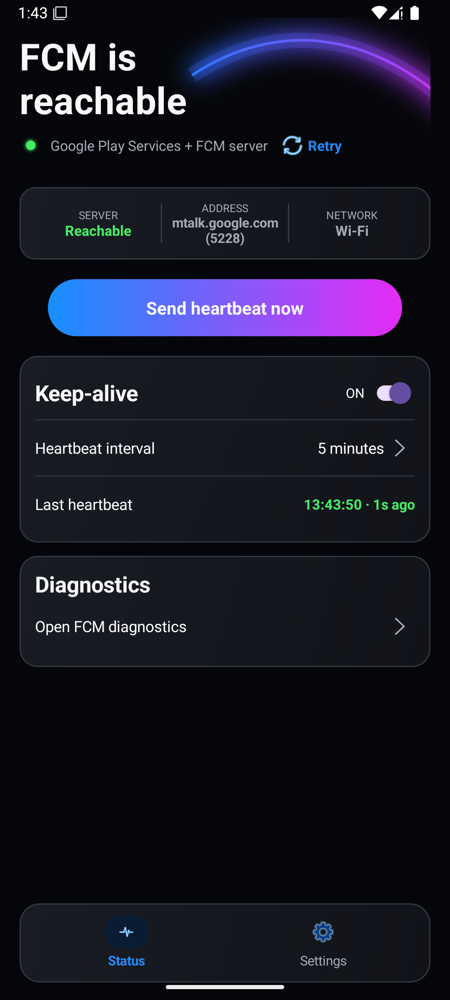
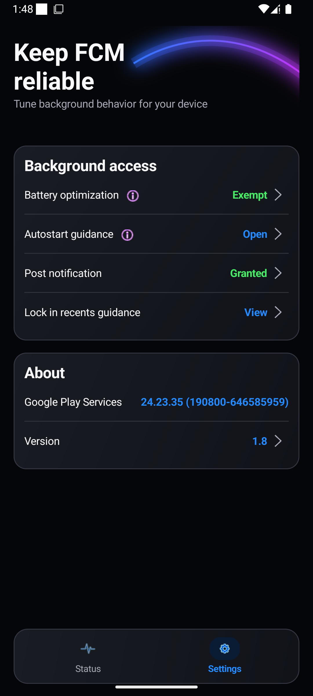

# FCM Status Checker — No Root Required

FCM Status Checker is an Android utility that tests whether Google Play Services can reach the Firebase Cloud Messaging (FCM) server and keeps the connection active with scheduled heartbeat checks. The project aims to help users identify and reduce FCM delivery failures caused by Doze, battery optimization, aggressive background restrictions, and unstable network or VPN conditions—without requiring root access, a Firebase project, or `google-services.json`.

## Screenshots

<p align="center">
  
  
</p>

The current screens were verified on an Android 15 emulator using the Samsung Galaxy S25 aspect ratio (1080 × 2340) and on a vivo Android 15 phone.

## What it checks

- **FCM server reachability** — probes `mtalk.google.com:5228` and reports whether the server is reachable
- **Google Play Services** — availability status and installed version
- **Notifications** — whether notifications are enabled and `POST_NOTIFICATIONS` is granted (Android 13+)
- **Network** — online/offline state and network type (Wi-Fi, cellular, or VPN)
- **Overall verdict** — green when Google Play Services, the network, and the FCM server are reachable

## FCM Keep-Alive (Heartbeat)

Uses undocumented Google Play Services broadcasts to send FCM heartbeats on a configurable interval of 1–10 minutes. Each scheduled heartbeat also checks `mtalk.google.com:5228` and updates the connection status shown in the app.

- Foreground service with an ongoing notification
- Self-rescheduling alarm that pierces Doze using `setAlarmClock()` on Android 12+
- Battery optimization and background-access guidance
- Survives reboot when keep-alive was enabled
- Last heartbeat time and interval shown live in the app

These broadcasts are not a public API. The internal GCM diagnostics screen can be opened from the app through a direct Intent when Google Play Services allows it.

### Battery optimization

Many manufacturers, including Samsung, vivo, Xiaomi, OnePlus, and Huawei, impose background restrictions beyond stock Android Doze. If the keep-alive stops running after the screen turns off:

1. Long-press the app icon and tap **App info**.
2. Open **Battery** or **Battery usage**.
3. Select **Unrestricted** or **Allow background usage**.

On vivo devices, also check **Background power consumption management** and choose **High background power usage** or **Don't restrict background power usage** when available.

### Autostart and recent-apps guidance

On vivo and other manufacturer ROMs, allow **Autostart** or **Background start** for FCM Status. If the system provides a **Lock in recents** option, lock FCM Status there. The Settings screen includes an info button with fallback paths for devices that use different menu names.

## Download

Pre-built APK: [Releases](https://github.com/gamma6ray/fcm-status/releases)

## Build from source

Requirements:

- JDK 17
- Gradle 8.9
- Android SDK (compileSdk 35, build-tools 35.0.0)

```bash
cd app-project
export ANDROID_SDK_ROOT=/path/to/android-sdk
gradle :app:assembleRelease
```

APK will be built at `app/build/outputs/apk/release/app-release.apk`.

### Build notes

- No `google-services.json` needed
- No Google Firebase services plugin
- Minimum SDK 26; target and compile SDK 35

## Tech stack

- Plain Java (no Kotlin / Compose)
- Programmatic UI via AppCompat
- AndroidX, Material Components, Play Services Base

## License

MIT
